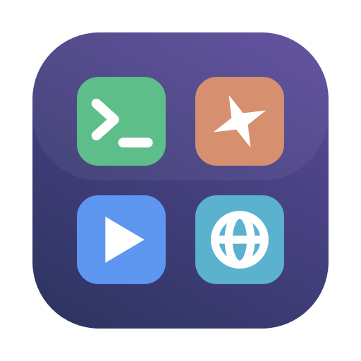

<p align="center">
  
</p>

<h1 align="center">Deck</h1>

<p align="center">
  <b>AI project manager & dev cockpit for macOS</b><br>
  A desktop for every project: launch dev services, run commands, browse locally —<br>
  and manage persistent <a href="https://claude.com/claude-code">Claude Code</a> sessions, all in one native app.
</p>

<p align="center">
  
  
  
  
</p>

---

Deck turns each of your projects into a **desktop**: drag icons anywhere — no folders forced on you. Double-click to start a dev server, run a one-shot command, open a URL in the embedded browser, or spawn an AI coding session that survives app restarts.

If you juggle multiple projects and multiple Claude Code terminals all day, Deck is the missing cockpit: an **AI project manager**, **dev service launcher**, and **multi-terminal workspace** in a single fast, native macOS app.

## Features

### 🗂 Multi-project desktops
Every project gets its own canvas. Icons are freely positionable (marquee & ⌘-click multi-select, folders for grouping services, copy/paste, ⌘P quick search, Enter to rename — it feels like the Finder desktop).

### ✳️ Persistent Claude Code sessions
Claude tabs run inside a dedicated **tmux** server: quit Deck, come back tomorrow — your AI sessions are still alive, with their conversation titles. Closed a tab? Right-click the Claude icon and **resume any past session** (`claude --resume`) with search & previews.

### 🔔 AI attention notifications
Deck installs Claude Code hooks automatically: when Claude finishes and waits for your input you get a sound, a notification, a Dock badge, and a red dot on the exact tab that needs you.

### ▶️ Service manager
Backend/frontend services (`npm run dev`, `php artisan serve`, workers, websockets) live in a dedicated **service panel** — status dots (port-aware readiness checks), stop/restart controls, "stop all", crash detection with exit output, kill-by-port, auto-start, and detection of externally-started services.

### ⚡ One-shot commands
`php artisan optimize`, `npm run build`… run them in a tab or **in the background** — you get a sound + notification when they finish.

### 🌐 Embedded browser
Project URLs open inside Deck (WKWebView) with **Web Inspector** enabled, mobile viewport toggle, and "Open in Chrome".

### ✨ AI-generated setup (`deck.json`)
Click **"Create with AI"**: Deck opens a Claude session with a task-focused prompt; Claude scans your repo (package.json scripts, artisan/horizon/queue workers, Makefile, docker-compose, README) and writes a `deck.json`. Deck watches the file and turns it into icons — ask Claude to "add a worker service" anytime and it appears on your desktop.

```json
{"items":[
  {"kind":"service","name":"Frontend","command":"npm run dev","port":5173,"folder":"Services"},
  {"kind":"service","name":"Horizon","command":"php artisan horizon","folder":"Services"},
  {"kind":"command","name":"Optimize","command":"php artisan optimize"},
  {"kind":"web","name":"App","url":"http://localhost:8000"}
]}
```

## Install

```bash
brew install tmux        # required for persistent Claude sessions
git clone https://github.com/ocracy/deck && cd deck
./install.sh             # builds & installs /Applications/Deck.app
```

Or grab `Deck.zip` from [Releases](https://github.com/ocracy/deck/releases), drop `Deck.app` into `/Applications`, then clear quarantine (ad-hoc signed):

```bash
xattr -cr /Applications/Deck.app && open -a Deck
```

## Development

```bash
swift build              # debug build
./build.sh               # package Deck.app
./dist.sh                # universal binary + Deck.zip for release
```

- Architecture: [`docs/DESIGN.md`](docs/DESIGN.md) · API contract: [`docs/API.md`](docs/API.md)
- Stack: Swift 5.9 · SwiftUI · [SwiftTerm](https://github.com/migueldeicaza/SwiftTerm) · tmux · WKWebView
- Everything is local & native — no Electron, no telemetry, instant switching.

## Why "Deck"?

Because your projects deserve a flight deck, not a tab graveyard. Keywords you might have searched to get here: *AI project manager, Claude Code session manager, macOS dev environment launcher, developer dashboard, multi-project terminal manager, tmux GUI, local dev services start/stop*.

## License

MIT
